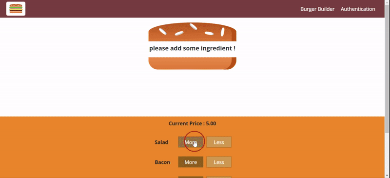

# Something-To-Remember

## Project Summary

Burger-Builder is a MERN application, which allows you to build your custom burger.  
## Developers

- **Developer 1: Elham Poshtiban**
  - https://compassionate-galileo-5b4397.netlify.app/
  - https://github.com/elhamposhtiban
  - https://www.linkedin.com/in/elham-poshtiban-2a40a4149/

## Getting started 
Click the deployed link below to use the application on the Firebase server, or follow the instructions below for local use.

Local Use
- use the clone button above copy the repository clone there.
- clone this repo to a local directory.
- run command 'npm install' to install necessary dependencies.
- then run command 'npm start' to launch the application.  

## Deployment   

 [Link](https://burger-react-73e07.firebaseapp.com/)   

## Animated Gifs/Pictures of App
 
 1:  

## Tech Stack
-	Language :  Javascript, CSS.  
-	Framework : React.
-	Routing : Express.
-	Database : Firebase.

## MVP
-	User Authentification   
-	Creating Check list 
-	Expenses Tracking  
-	Design UI with Sass 

## Stretch Goals
-	Making a gift list for guests with sharing features.
-	Allowing users to provide reviews and leave comments.
-	Adding the multi-languages feature to all application.    
-	Adding advice & articles page related to the purpose of the application.